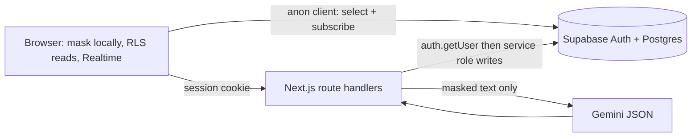

# Kavach — AI scam shield

Kavach ("shield" in Hindi) is a real, production-style web app: paste a suspicious message, get a Gemini risk verdict, share dangerous scans with family over Supabase Realtime, and generate a recovery plan plus complaint drafts.

Repo: [github.com/Pegasus717/CyberKavach](https://github.com/Pegasus717/CyberKavach)

## What you must do once (manual)

1. Create a [Supabase](https://supabase.com) project.
2. In **Authentication → Providers**, enable Email. For a hackathon, turn **Confirm email** off so two test users can sign in immediately.
3. Open the SQL editor and run `supabase/schema.sql` **once**. If `alter publication supabase_realtime add table` errors because the table is already in the publication, skip those two lines and re-run the rest.
4. Copy `.env.local.example` to `.env.local` and fill:
   - `NEXT_PUBLIC_SUPABASE_URL`
   - `NEXT_PUBLIC_SUPABASE_ANON_KEY` (anon or publishable key)
   - `SUPABASE_SERVICE_ROLE_KEY` (service_role or secret key — server only)
   - `GEMINI_API_KEY` (server only)
   - `GEMINI_MODEL` (optional; defaults to `gemini-2.5-flash`)
5. Restart `npm run dev`. Open `/setup` if anything is missing. `/api/health` returns booleans only.

## Run locally

```bash
npm install
cp .env.local.example .env.local
# fill keys, run schema.sql in Supabase
npm run dev
```

- App: http://localhost:3000
- Setup: http://localhost:3000/setup
- Health: http://localhost:3000/api/health

```bash
npm run test
npm run typecheck
npm run lint
npm run build
```

## Architecture



Writes never go from the browser into `scans`, `connections`, or `complaints`. The cookie server client verifies the user; the service-role client writes.

## Deploy to Vercel (needed so two phones share one backend)

1. Push this repo (already: `Pegasus717/CyberKavach`).
2. Import the project in Vercel.
3. Set the same env vars as `.env.local.example`. Never set `SUPABASE_SERVICE_ROLE_KEY` or `GEMINI_API_KEY` with a `NEXT_PUBLIC_` prefix.
4. In Supabase Auth, add `https://YOUR_DOMAIN` to redirect URLs.
5. Redeploy after schema is applied.

## Assumptions

- Email + password auth; display name is stored in `raw_user_meta_data.display_name` and on `profiles`.
- Country-specific advice uses the profile `country` (`IN` default, also `US` / `UK`). UK channels are marked `verified: false`.
- Gemini may be omitted: analysis falls back to a heuristic with the badge “AI unavailable, basic check only”. Complaint Writer and screenshot OCR still need Gemini.
- In-memory rate limit (20 analyses / user / minute) is per server instance.
- Real Android background SMS scanning is **not** built. A future native module would mask on-device, then call `/api/analyze`. The PWA Web Share Target (`GET`, `text`) is the web substitute.

## Privacy

Raw messages are masked in the browser before send; the server re-masks. Only masked text is stored. Family members see masked text, and only for `likely_scam` / `dangerous` when the owner’s sharing flag is on (RLS).
